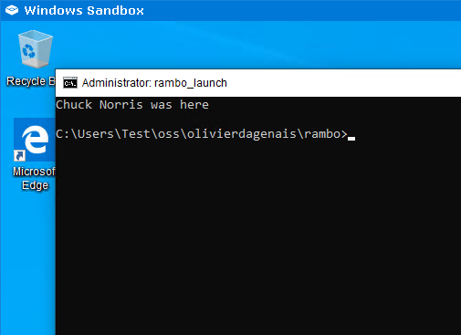

# Rambo

Rambo is a bit of automation around [Windows Sandbox](https://docs.microsoft.com/en-us/windows/security/threat-protection/windows-sandbox/windows-sandbox-overview) to generate a .wsb file that launches the designated program after mounting that program's folder.

## Requirements

1. Windows 10 Pro or Enterprise
2. The "Windows Sandbox" feature enabled, which can be done via:
    1. Open an elevated PowerShell prompt
    2. Run `Enable-WindowsOptionalFeature -FeatureName "Containers-DisposableClientVM" -All -Online`
    3. Reboot

## Try it

```batch
rambo.bat attack.bat
```

This should:

1. Generate a temporary `rambo.wsb` file which:
    1. Shares the folder where `attack.bat` is found, with the same path inside the sandbox, in read-only mode.
    2. Launches a generated `rambo_launch.bat` file, which will in turn launch `attack.bat` using `START` such that the console is visible, allowing progress to be tracked and diagnosis if there were any errors.
2. Launch Windows Sandbox against the generated `rambo.wsb` file.
3. Deletes the generated files once the sandbox is closed.

Here's a preview of the result!



## Integration with Visual Studio Code

### One-time setup

1. Do you have a batch file? If so, skip this step, otherwise create `test.bat` as follows (we're assuming that `setup.bat` exists in the current folder and that's what we want to test in the Windows Sandbox):

    ```bat
    @echo off
    C:\Users\odagenais\oss\olivierdagenais\rambo\rambo.bat setup.bat
    ```

1. Do you have a task? If so, skip this step, otherwise create one as follows:
    1. F1 > Tasks: Run Task > Configure a Task > Create tasks.json file from template > Others
    1. Set the `label` to `Test with Rambo`
    1. Set the `type` to `process`
    1. Set the `command` to `test.bat`
1. F1 > Tasks: Configure Default Test Task
    1. Select `Test with Rambo`
1. File > Preferences > Keyboard Shortcuts
    1. Bind "Tasks: Run Test Task" to a keyboard shortcut, such as `Ctrl`+`Shift`+`T`

### Launching the "Test with Rambo" task

It's probably one of these:

1. F1 > Tasks: Run Test Task
1. `Ctrl`+`Shift`+`T`
